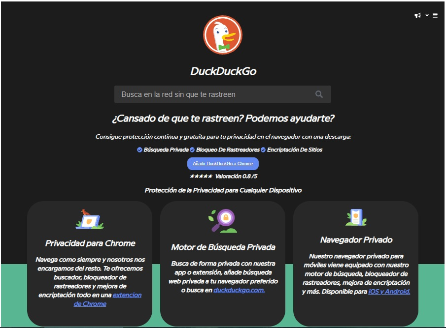
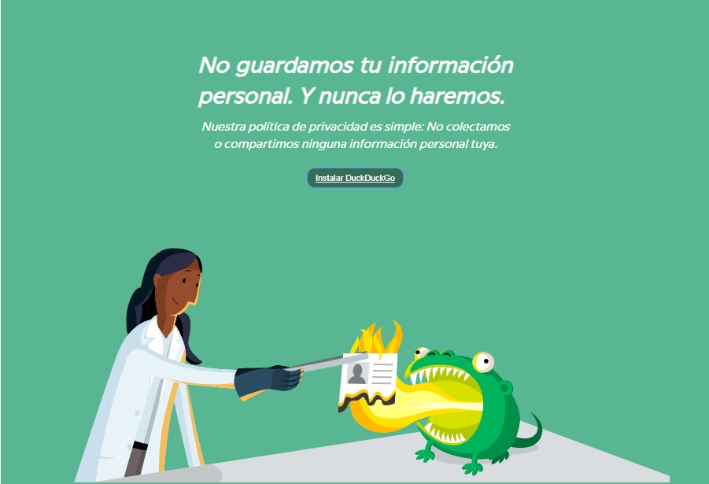
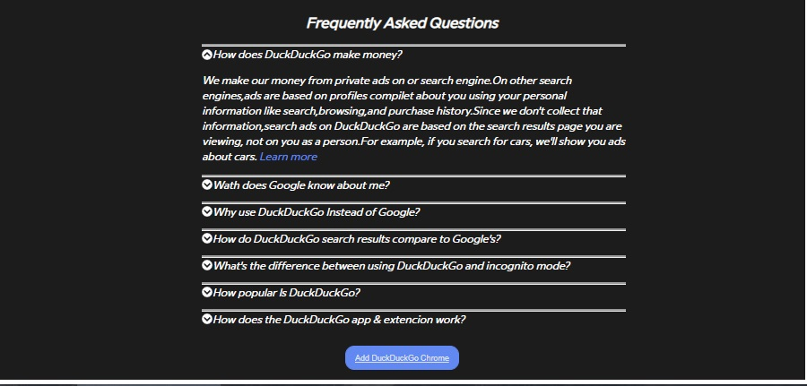

***
# *DUCKDUCKGO*
***
## Sobre el proyecto

Esto es una replicar el sitio de **Duckduckgo** desde cero.

* El resultado a lograr lo puedes puedes ver en el [sitio original](https://duckduckgo.com/).

## Consideraciones
 
* Encontrarás un archivo `index.html` con la
  estructura del proyecto y enlazar tus archivos de estilos (CSS) y (JavaScritp).

* Para los estilos CSS estara el archivo llamado `estilos-pato`.

* En la parte de JavaScript estara el archivo llamado `logica`.

* Esta web utiliza la tipografía `ProximaNova`.

## Aprendizaje
* Para esta replica hice uso de:
  * Selector de elemento, id y clase.
  * Identacion.
  * Uso de JavaScript.
  * Eventos en HTML.
  * Seudo-clases.
  * Libreria externa y local para tipografia.
  * Colores gradientes.

## Resultado Replica

